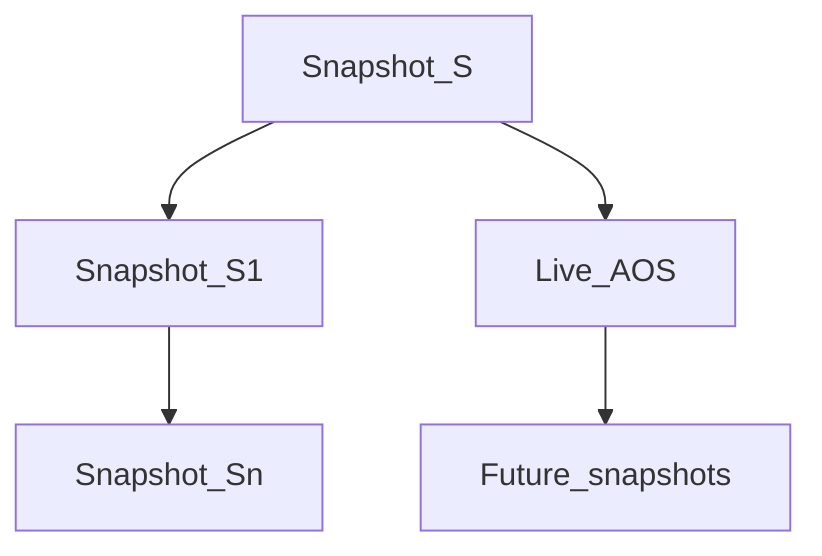
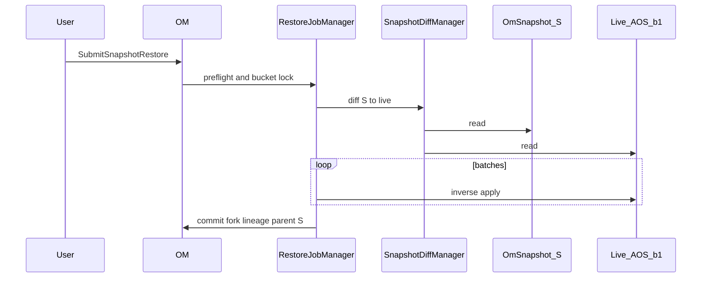
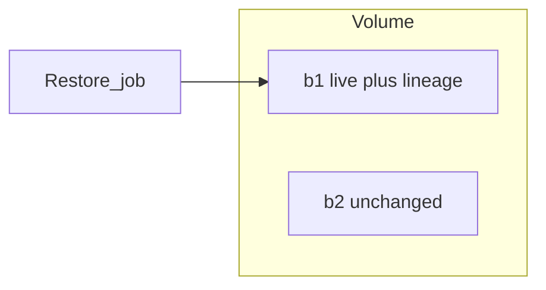

<!--
  Licensed under the Apache License, Version 2.0 (the "License");
  you may not use this file except in compliance with the License.
  You may obtain a copy of the License at

   http://www.apache.org/licenses/LICENSE-2.0

  Unless required by applicable law or agreed to in writing, software
  distributed under the License is distributed on an "AS IS" BASIS,
  WITHOUT WARRANTIES OR CONDITIONS OF ANY KIND, either express or implied.
  See the License for the specific language governing permissions and
  limitations under the License. See accompanying LICENSE file.
-->

# Ozone Snapshot Restore (Fork Semantics)

## Problem statement

Ozone snapshots provide read-only, point-in-time bucket images via RocksDB checkpoints
([Snapshot feature doc](../feature/Snapshot.md)). Today, **restore is manual** (for example
`ozone fs -cp` from `.snapshot/<name>/`). Operators need a **native restore** that rewinds
the **live bucket namespace** to a chosen snapshot **S** without disturbing unrelated buckets
or discarding snapshots taken after **S**.

This document defines **fork restore** semantics and outlines OM changes (API, chain model,
SnapDiff, defrag). Implementation is a follow-on phase behind an OEP/Jira epic.

## Goals

1. After restoring bucket **b1** to snapshot **S**, live **b1** matches the namespace of **S**
   (LEGACY or FSO layout).
2. Unrelated bucket **b2** is unchanged (scope = one resolved source bucket).
3. All snapshots **S′** newer than **S** on **b1** remain readable; their checkpoint DBs are
   **not** deleted (not HDFS linear rollback).
4. The **active lineage** re-parents on **S**: live becomes the mutable head of a new branch;
   future `createSnapshot` on **b1** extends this branch, not the old tip **Sn**.

## Non-goals (v1)

- Rewinding bucket ACLs, quotas, encryption policy, or layout.
- Cross-bucket clone / DR copy (separate feature).
- Partial-prefix restore (whole bucket only).
- S3 API for restore (CLI + ObjectStore first).

## Background (current implementation)

- **Create snapshot:** `SnapshotInfo` in AOS + RocksDB checkpoint; bucket-scoped rows scrubbed
  from AOS `deletedTable` / `deletedDirTable` / `snapshotRenamedTable`
  (`OmSnapshotManager.createOmSnapshotCheckpoint`).
- **Read snapshot:** `OmSnapshot` over checkpoint DB; `.snapshot/` path normalization.
- **SnapshotDiff:** async compare snapshot ↔ snapshot or snapshot ↔ live; read-only.
- **Path chain:** `SnapshotChainManager` keeps a **linear** list per `/volume/bucket`;
  `validateAddSnapshotPath` rejects a second child of the same parent (non-linear chain).

Integration tests in `TestOzoneSnapshotRestore` validate copy-based restore only and document
FSO/`createFakeDirIfShould` issues with `ozone fs -cp`.

## Semantic models considered

| Model | Behavior | Selected |
| ----- | -------- | -------- |
| Linear rollback (HDFS-like) | Purge snapshots after **S** | No |
| Fork without chain update | Rewind live; keep **S′**; next snapshot still chains from **Sn** | No |
| **Fork with active lineage re-parent** | Rewind live; keep **S′**; active branch parent = **S** | **Yes** |

### Lineage before and after restore

Before (linear): `S → S1 → … → Sn`, live evolved after **Sn**.

After fork restore to **S**:

- Historical branch: `S → S1 → … → Sn` (unchanged checkpoints).
- Active branch: `S → Live (namespace = S) → future snapshots`.

### Namespace apply rules (live vs **S**)

| Comparison | Action |
| ---------- | ------ |
| In live, not in **S** | Delete from live (normal delete / deep clean paths) |
| In **S**, not in live | Create in live from **S** metadata (reuse block IDs when pinned) |
| In both, differs | Replace live with **S** version |
| Renamed since **S** | Inverse rename to match **S** |

If blocks were reclaimed and no snapshot references them, metadata restore may succeed while
reads fail — OEP will define fail-fast vs best-effort.

## Chain and lineage metadata

Live is not in `snapshotInfoTable` until `createSnapshot`. Restore must persist:

1. **Logical active lineage** (Ratis-durable), e.g. on `OmBucketInfo` or a small side table:
   - `activeBranchParentSnapshotId = S`
   - `restoreGeneration` (monotonic per bucket)
   - optional `historicalBranchTipSnapshotId = Sn` for ops/UI
2. **Physical chain** updates so the active branch can grow from **S** while **S1…Sn** remain
   addressable.

**Constraint:** today's linear `SnapshotChainManager` cannot attach a second successor to **S**
while **S1** already exists. Fork restore requires **chain evolution** (OEP choice):

- **A. Path DAG (recommended):** multiple successors; `latestSnapshotIdByPath` = active branch tip.
- **B. Branch IDs:** `pathPrevious` only within branch; restore starts new branch at **S**.
- **C. Optional post-restore snapshot:** materialize head as checkpoint (may combine with A/B).

**Rejected:** purge-newer-snapshots on restore.

## Restore algorithm (diff-driven apply)

Prefer reusing **SnapshotDiff** (`S` → live) and applying the **inverse** in batches under
bucket lock — not bulk copying checkpoint rows into AOS (prefix mismatch, quotas, FSO tables,
Ratis).

1. Preflight: auth (owner/admin), feature flag, no conflicting delete/defrag/diff/restore jobs.
2. Async **RestoreJob** (pattern: `SnapshotDiffManager`).
3. Compute diff **S** → live.
4. Apply inverse: diff CREATE → delete live; diff DELETE → create from **S**; MODIFY/RENAME
   from snapshot side; FSO ordering as SnapDiff.
5. Post-commit: fork lineage, quota refresh, metrics; **do not delete S′**.

## SnapDiff after fork

| Request | Expected |
| ------- | -------- |
| **S** ↔ live | Empty (or minimal) right after restore |
| **S1** ↔ **Sn** | Unchanged (historical branch) |
| **Sn** ↔ live | Large (abandoned timeline vs current live) |
| live ↔ new snapshot | Normal on active branch |

Cross-branch diffs must use **direct/full** diff; disable incremental chain-walk when no
single path connects endpoints. Compaction DAG nodes for **S1…Sn** remain; document perf
when diff crosses fork.

## Defrag after fork

Per [Snapshot defrag](../feature/SnapshotDefragmentation.md): walk **branches** independently
via local `previousSnapshotId` in `OmSnapshotLocalData`; never merge defrag across branches.

## API sketch (future)

| RPC | Purpose |
| --- | ------- |
| `SubmitSnapshotRestore` | Start job; target **S**; optional `failOnMissingBlocks` |
| `GetSnapshotRestore` | Status / progress / errors |
| `CancelSnapshotRestore` | Cancel between batches |
| `ListSnapshotRestoreJobs` | Ops |

CLI: `ozone sh snapshot restore /vol/bucket <snapName> [--dry-run] [--wait]`

Config (draft): `ozone.om.snapshot.restore.enabled`, thread pool, batch size, max keys per job.

## Blast radius

## Open questions

1. Chain evolution: DAG vs branch IDs vs optional post-restore snapshot.
2. Missing blocks: fail job vs best-effort report.
3. Restore job table: colocate with SnapDiff DB or separate.
4. Writes to **b1** blocked during apply; reads allowed?

## References

- [Ozone Snapshot](../feature/Snapshot.md)
- [Snapshot defrag](../feature/SnapshotDefragmentation.md)
- `SnapshotChainManager`, `SnapshotDiffManager`, `TestOzoneSnapshotRestore`
