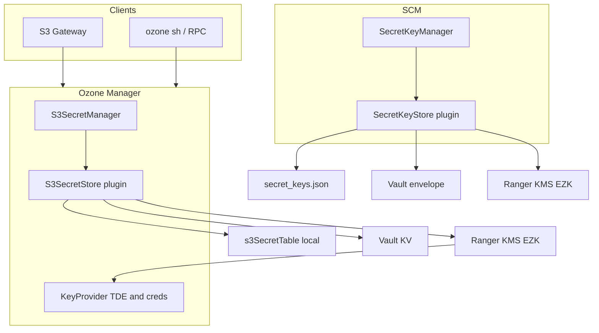

<!--
  Licensed under the Apache License, Version 2.0 (the "License");
  you may not use this file except in compliance with the License.
  You may obtain a copy of the License at

   http://www.apache.org/licenses/LICENSE-2.0

  Unless required by applicable law or agreed to in writing, software
  distributed under the License is distributed on an "AS IS" BASIS,
  WITHOUT WARRANTIES OR CONDITIONS OF ANY KIND, either express or implied.
  See the License for the specific language governing permissions and
  limitations under the License. See accompanying LICENSE file.
-->

# Abstract

Apache Ozone persists several classes of sensitive material on disk: S3 user secrets,
SCM symmetric signing keys, service PKI private keys, delegation token metadata,
and (when TDE is enabled) encrypted data encryption keys in OM RocksDB. Today most
of this is **local plaintext** or local PEM files. Operators need a **consistent,
configurable model** to store the same assets in **local storage**, **HashiCorp Vault**,
or **Ranger KMS**, without conflating object encryption (TDE) with credential storage.

This document proposes architecture, configuration, Ranger KMS mapping (based on an
internal PoC treating S3 credentials as Encryption Zone Keys), OM HA behavior, migration,
and phased implementation. It builds on the inventory in
[sensitive-metadata-vault-survey.md](sensitive-metadata-vault-survey.md) and related
designs ([secure-s3.md](secure-s3.md), [symmetric-token-signatures.md](symmetric-token-signatures.md),
[ozone-sts.md](ozone-sts.md), [tde.md](tde.md)).

# 1. Problem statement

In secure deployments (`ozone.security.enabled=true`):

* **S3 secrets** default to OM RocksDB `s3SecretTable` as plaintext `awsSecret` values.
  Anyone with OM metadata access can impersonate S3 users ([secure-s3.md](secure-s3.md)).
* **SCM token-signing keys** default to `{metadata}/scm/keys/secret_keys.json` as JSON with
  Base64-encoded HMAC key material (`LocalSecretKeyStore`). Leakage enables forging
  delegation, block/container, and STS session tokens until keys expire.
* **Aggregated copies** of OM metadata (Ratis storage, checkpoints, Recon OM snapshots)
  amplify exposure when secrets live in RocksDB.
* **OM HA replication** can carry short-lived secrets in Ratis payloads (for example
  `UpdateGetS3SecretRequest.awsSecret`, `UpdateAssumeRoleRequest.secretAccessKey`).

Goals:

1. Support **three backends** per asset class where appropriate: **local**, **Vault**, **Ranger KMS**.
2. When using remote backends, **avoid storing raw secrets in OM RocksDB** (and thus Recon snapshots).
3. Reuse **one KMS cluster URI** for TDE and credential EZKs via **strict alias namespacing**.
4. Preserve **Ranger authorization and audit** for KMS-stored credentials (`cm_kms` policies).
5. Keep **hot-path signing/verification in memory** on SCM/OM/DN (no per-request Vault/KMS round trip).

Non-goals for this proposal:

* Replacing Kerberos, Ranger policy content, or operator network isolation (see [THREAT_MODEL.md](../../../../THREAT_MODEL.md)).
* Storing ephemeral block/container/STS bearer tokens in an external vault (they are not OM-durable state).

# 2. Architecture overview



**Plugin pattern (S3, today):** `ozone.secret.s3.store.provider` selects
`S3SecretStoreProvider` implementation; `S3SecretManagerImpl` is unchanged.
Vault is implemented in `ozone-s3-secret-store` (`VaultS3SecretStore`).

**Extension (SCM, proposed):** replace hard-coded `LocalSecretKeyStore` in
`SecretKeyManagerService` with configurable `SecretKeyStore` implementations.

# 3. Asset taxonomy and backend matrix

| Asset class | Local (default today) | HashiCorp Vault | Ranger KMS (EZK) | Implementation phase |
| --- | --- | --- | --- | --- |
| S3 access key + secret | `s3SecretTable` | `VaultS3SecretStore` (exists) | **New** `RangerKmsS3SecretStore` | **A** |
| SCM HMAC signing keys | `secret_keys.json` | Transit / envelope on disk | EZK per key UUID (`ozone.scm.signing.*`) | **B** |
| Service PKI `private.pem` | PEM under `{metadata}/{component}/keys/` | Vault PKI / secrets engine | **Not recommended** | **C** (guidance only) |
| Delegation token metadata | `dTokenTable` | — | — | Local + optional OM DB encryption |
| STS revocation cutoffs | `s3RevokedStsTokenTable` | — | — | Local metadata |
| TDE key names + EDEKs | OM DB + KMS | — | **Already via KMS** | Unchanged |

Path conventions: `{metadata}` = `hdds.metadata.dirs` or `ozone.metadata.dirs`;
components `om`, `scm`, `dn`, `recon` for PKI files (`SecurityConfig.getKeyLocation`).

# 4. Backend options

## 4.1 Local storage (existing)

| Asset | Mechanism |
| --- | --- |
| S3 secrets | `OmMetadataManagerImpl` → `s3SecretTable`; Ratis batch via `S3Batcher` when `isBatchSupported()` |
| SCM signing keys | `LocalSecretKeyStore` → `secret_keys.json`, POSIX 0600 |
| PKI | `private.pem` / `certificate.crt` per component |

**Operator requirements:** restrictive permissions, encrypted volumes, protected backups
(THREAT_MODEL §10).

## 4.2 HashiCorp Vault (partially implemented)

| Asset | Mechanism |
| --- | --- |
| S3 secrets | `VaultS3SecretStorageProvider`; config `ozone.secret.s3.store.remote.vault.*` |
| SCM signing keys | **Proposed:** envelope-encrypted `secret_keys.json` or Vault-stored blob; SCM unwrap at startup/rotation |
| PKI | Vault PKI engine or static secret paths |

Remote S3 store: `isBatchSupported()` is false; each OM applies writes during Ratis
(`S3GetSecretRequest`, `OMSetSecretResponse`).

## 4.3 Ranger KMS (proposed for credentials)

Ranger KMS already backs **TDE** via `hadoop.security.key.provider.path`. This design
**reuses the same URI** and introduces **mandatory alias prefixes** so credential keys
do not collide with bucket encryption zone keys.

### 4.3.1 PoC model: S3 credentials as Encryption Zone Keys (EZK)

Internal PoC (*Ranger KMS APIs for S3 Creds*) maps S3 credentials to rows in
`ranger_keystore`:

* **Master Key (MK):** generated at KMS startup; MK material encrypted at rest in KMS DB;
  used only inside KMS to wrap zone keys.
* **EZK:** per-credential symmetric material; `kms_encoded` holds secret encrypted under MK;
  plaintext never stored in Ozone.

**Ozone mapping (access-id-centric, not bucket-centric):**

| KMS field | Ozone use |
| --- | --- |
| `kms_alias` | `ozone.s3.{sanitizedAccessId}` — see §4.3.3 |
| `kms_attributes` | JSON: `awsAccessKey` (access id / user principal), `key.acl.name`, optional `tenantId` |
| `kms_encoded` | AWS secret (encrypted by MK inside KMS) |
| `kms_version` | Secret rotation; versioned aliases `alias@N` in KMS |

**Operations** (Hadoop `KeyProvider` / `KeyProviderCryptoExtension`, same family as
`hadoop key` CLI used in PoC):

| Ozone operation | KMS operation |
| --- | --- |
| Create / assign secret | `createKey` with material or generated secret |
| Set / rotate secret | `rollNewVersion` (new version row) |
| SigV4 verify (`getSecretString`) | Read **current** key version material |
| Revoke | `deleteKey` + OM cache invalidation |

**Authentication:** Kerberos (SPNEGO) from OM service principal to KMS; DelegationToken
may be used in CDP-style deployments for OM→KMS.

**Authorization:** Ranger **`cm_kms`** policies on keys matching `ozone.s3.*` (and
`ozone.scm.signing.*` for SCM). PoC validated create/update/get with per-user policies
and audit in Ranger UI (`keyadmin`).

### 4.3.2 SCM signing keys on Ranger KMS

Each `ManagedSecretKey` UUID maps to alias `ozone.scm.signing.{uuid}`. Material is
HMAC key bytes (same algorithm as today, e.g. `HmacSHA256`). SCM **loads** keys at
initialize/rotate into memory; datanodes/OM continue to fetch via existing secret-key RPC.

Persisted `secret_keys.json` on SCM nodes becomes optional: either empty, encrypted
envelope only, or retained as cache after KMS fetch (implementation detail in Phase B).

### 4.3.3 Alias naming and collisions

* **Prefix:** default `ozone.s3.` for S3 creds, `ozone.scm.signing.` for SCM keys.
* **TDE keys** must **not** use these prefixes; operators document separate Ranger policies.
* **Sanitization:** KMS `kms_alias` is `VARCHAR(255)`. Access ids may contain characters
  invalid for aliases or exceed length. Options (pick one at implementation time):
  1. **Sanitize** access id to `[A-Za-z0-9._-]` with documented rules; or
  2. **Hash-based alias** `ozone.s3.sha256.{hex}` plus optional OM metadata table
     `accessId → alias` (no secret in OM, only mapping).

### 4.3.4 PKI and Ranger KMS

RSA/EC SCM CA and service `private.pem` files are **poor fits** for the EZK model used
for symmetric secrets. Recommendation: **local + FDE** or **Vault PKI**; do not store CA
private keys as generic EZKs unless as an opaque last resort.

# 5. Configuration (proposed)

## 5.1 Global default (optional)

```properties
# local | vault | ranger-kms — optional default for new secret classes
ozone.security.secrets.backend=local
```

Per-class settings override the default.

## 5.2 S3 secrets (existing + new provider)

```properties
ozone.secret.s3.store.provider=org.apache.hadoop.ozone.om.s3.LocalS3StoreProvider
# org.apache.hadoop.ozone.s3.remote.vault.VaultS3SecretStorageProvider
# org.apache.hadoop.ozone.s3.remote.kms.RangerKmsS3SecretStorageProvider  (proposed)

ozone.secret.s3.store.cache.expireTime=600
ozone.secret.s3.store.cache.capacity=...

# Ranger KMS S3 store (proposed)
ozone.secret.s3.store.remote.kms.alias.prefix=ozone.s3.
```

Vault keys remain under `ozone.secret.s3.store.remote.vault.*`
(`S3SecretRemoteStoreConfigurationKeys`).

**KMS URI:** reuse `hadoop.security.key.provider.path` and OM `kmsProvider`
(`OzoneManager.createKeyProviderExt`). No separate URI required for S3 creds when
using shared KMS (operator choice locked in for this design).

## 5.3 SCM signing keys (proposed)

```properties
hdds.secret.key.store.provider=local
# vault | ranger-kms

hdds.secret.key.store.remote.kms.alias.prefix=ozone.scm.signing.
```

Existing rotation settings unchanged: `hdds.secret.key.rotate.duration`,
`hdds.secret.key.expiry.duration`, etc.

# 6. OM high availability and Ratis

## 6.1 Current behavior

* **Local backend:** new secrets often replicated via Ratis with plaintext in
  `UpdateGetS3SecretRequest` (`S3GetSecretRequest.preExecute`); persisted in
  `s3SecretTable` on batch commit.
* **Vault backend:** `S3SecretStore.batcher()` is null; `storeSecret` runs on **each OM**
  during apply (`!isBatchSupported()`). Must be **idempotent** (create-if-absent, tolerate
  duplicate apply).

## 6.2 Target hardening (Phase C)

* Leader performs **single** write to Vault/KMS; Ratis carries **access id + version /
  metadata only**, not raw `awsSecret` or STS `secretAccessKey`.
* Applies to `UpdateGetS3SecretRequest` and `UpdateAssumeRoleRequest` replication.

Until Phase C, operators should encrypt `ozone.om.ratis.storage.dir` and restrict access.

# 7. Caching, Recon, and disaster recovery

* **S3SecretCache:** unchanged; shorten TTL when using remote backends if needed.
* **Recon:** with Vault/KMS S3 backend, `s3SecretTable` stays empty → snapshots omit S3
  plaintext; Recon still holds delegation metadata and EDEKs if enabled.
* **DR:** Ranger KMS requires MK password and KMS DB backup; Vault requires unseal policy;
  document alongside Ozone metadata backup.

# 8. Migration

**Local → Vault or Ranger KMS (S3):**

1. Configure target backend on a staging OM.
2. For each access id: read secret (admin CLI), create key in Vault/KMS, verify S3 auth.
3. Cut over `ozone.secret.s3.store.provider` on all OMs (rolling restart or config sync).
4. Optionally delete rows from `s3SecretTable` after verification.

Prefer **no new OM layout version**: remote backends should not require storing secrets in
RocksDB. If a mapping table (access id → alias) is added, gate via `OMLayoutFeature`.

**SCM signing keys:** Phase B requires coordinated SCM upgrade; all SCM peers must use the
same `SecretKeyStore` type; validate rotation and HA failover.

# 9. Testing and operations

* Unit tests: mock `KeyProvider` for `RangerKmsS3SecretStore` (mirror `TestVaultS3SecretStore`).
* Integration: MiniKDC + Ranger KMS or KeyProvider test double; multi-OM apply idempotency.
* Ranger: sample `cm_kms` policies for OM principal on `ozone.s3.*` and SCM on
  `ozone.scm.signing.*`.
* Failure modes: KMS unavailable → S3 auth fails for affected secrets; cache may serve
  stale material after rollover until TTL/invalidation.

# 10. Implementation phases

| Phase | Deliverable |
| --- | --- |
| **A** | `RangerKmsS3SecretStore` + provider in `ozone-s3-secret-store`; docs/config; mock tests |
| **B** | Pluggable `SecretKeyStore` on SCM (local / Vault envelope / Ranger KMS) |
| **C** | Ratis payload hardening; PKI operator guide (Vault vs local) |

Phase A does not require OM DB schema changes.

# 11. Risks and open questions

| Risk | Mitigation |
| --- | --- |
| Alias collision with TDE EZ keys | Mandatory `ozone.s3.*` / `ozone.scm.signing.*` prefixes + Ranger policies |
| Long or special access ids | Hash-based alias + optional OM mapping table |
| PoC vs Apache KeyProvider API drift | Validate against target Ranger KMS version; map REST to `KeyProvider` in implementation |
| Multi-OM duplicate create on KMS | Idempotent create; handle "already exists" |
| KMS outage | Operational runbook; cache bounds |

**Open:** canonical encoding for combined access+secret in one EZK (PoC mentions
base64 bundle) vs separate attributes + encoded secret only — **recommend secret in
`kms_encoded`, access id in `kms_attributes`** for Ozone.

# 12. References

| Reference | Link / location |
| --- | --- |
| Sensitive metadata survey | [sensitive-metadata-vault-survey.md](sensitive-metadata-vault-survey.md) |
| Secure S3 keys (HDDS-8132) | [secure-s3.md](secure-s3.md) |
| Symmetric token signatures (HDDS-7733) | [symmetric-token-signatures.md](symmetric-token-signatures.md) |
| TDE | [tde.md](tde.md) |
| Threat model (operator duties) | [THREAT_MODEL.md](../../../../THREAT_MODEL.md) |
| **Ranger KMS S3 creds PoC (Google Doc)** | https://docs.google.com/document/d/1KGR1QrhvZ7hJ6z1Qj9dRHyB0aDLBGY907EdMC6JV34Q/edit?usp=sharing |
| `S3SecretStore` | `hadoop-ozone/ozone-manager/.../S3SecretStore.java` |
| `VaultS3SecretStore` | `hadoop-ozone/s3-secret-store/.../VaultS3SecretStore.java` |
| `LocalSecretKeyStore` | `hadoop-hdds/framework/.../LocalSecretKeyStore.java` |
| `OMDBDefinition` | `hadoop-ozone/ozone-manager/.../OMDBDefinition.java` |
