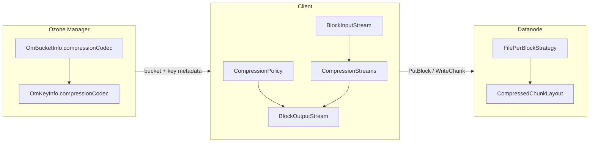

<!---
  Licensed to the Apache Software Foundation (ASF) under one or more
  contributor license agreements.  See the NOTICE file distributed with
  this work for additional information regarding copyright ownership.
  The ASF licenses this file to You under the Apache License, Version 2.0
  (the "License"); you may not use this file except in compliance with
  the License.  You may obtain a copy of the License at

      http://www.apache.org/licenses/LICENSE-2.0

  Unless required by applicable law or agreed to in writing, software
  distributed under the License is distributed on an "AS IS" BASIS,
  WITHOUT WARRANTIES OR CONDITIONS OF ANY KIND, either express or implied.
  See the License for the specific language governing permissions and
  limitations under the License.
-->

## Summary

Phase 1 adds **transparent at-rest compression** for Ozone keys: operators enable a **compression codec on a bucket**, clients compress data before sending it to datanodes, and datanodes persist **compressed payloads** with enough metadata to read, scrub, and reconcile blocks. Logical object size and checksums remain defined over **uncompressed** bytes.

## Problem statement

Object stores often hold compressible text, logs, and columnar exports. Storing those bytes verbatim wastes disk and network bandwidth. Users expect compression to be:

* **Transparent** — existing read/write APIs return logical (uncompressed) data.
* **Policy-driven** — enable per bucket, not per application code path.
* **Safe with existing features** — replication, scrub, reconciliation, and composite checksums must understand logical vs physical chunk lengths.

Phase 1 targets the **replicated Ratis block write path** used by the Java client and `ozone sh` key operations.

## Non-goals (Phase 1)

* Erasure-coded **write** compression (EC read paths may decompress when metadata indicates compression).
* **Datastream** write path compression.
* **S3** API bucket configuration for compression codec.
* **Re-compression** or codec migration of existing keys when bucket policy changes.
* **Server-side** compression inside the datanode (compression is performed on the client).
* Automatic codec selection based on content type beyond the extension denylist.

These may be addressed in later phases.

## Architecture overview



### Control plane (OM)

* **Bucket property** `compressionCodec` (`NONE`, `ZSTD`, `SNAPPY`, `LZ4`, `GZIP` in protobuf; Phase 1 testing focuses on **ZSTD**).
* **Key property** `compressionCodec` recorded at create/overwrite/multipart initiate when layout allows.
* **Layout feature** `OMLayoutFeature.COMPRESSION_SUPPORT` (layout version **9**): OM rejects non-`NONE` codec until the cluster has finalized this layout version.
* **Policy** `CompressionPolicy.resolveKeyCodec()` chooses the effective codec per key:
  * Bucket codec must be enabled.
  * **Encryption at rest** on the key disables compression.
  * **Extension denylist** (`ozone.om.compression.skip.extensions`) skips compression for already-compressed or media types (default includes `.parquet`, `.orc`, `.gz`, images, etc.).

### Data plane (client)

* On write, `BlockOutputStream` compresses each chunk with `CompressionStreams`, sends **compressed bytes** to the datanode, and sets chunk protobuf fields:
  * `len` — physical (compressed) length.
  * `logicalLen` — uncompressed length used for offsets and composite CRC.
* On read, `ChunkInputStream` / `BlockInputStream` decompress using the key/bucket codec from block metadata.
* **Checksums** on the wire for compressed chunks are computed over **compressed** payload; composite block checksums use **logical** lengths (`ReplicatedBlockChecksumComputer`).

### Data plane (datanode)

* **File-per-block** storage writes each compressed segment as:

  | Region | Size | Content |
  |--------|------|---------|
  | OC header | 10 bytes | Magic `OC`, `logicalLen`, `compressedLen` |
  | Payload | `compressedLen` | ZSTD (or other) bytes from client |
  | OZCI footer (optional) | variable | Index for scrub / recovery (`OZCI` magic) |

* `BlockData` carries `compressionCodec` at block level for reconcile and container check.
* **Container scrub** (`KeyValueContainerCheck`) validates compressed layout and logical lengths.
* **Reconciliation** (`KeyValueHandler.reconcileChunksPerBlock`):
  * Peer reads disable client checksum expansion that assumes logical size on compressed data.
  * Copies `compressionCodec` onto local `BlockData` when repairing from a peer.

### Layout feature (HDDS)

* `HDDSLayoutFeature.COMPRESSED_CHUNKS` (layout version **10**): datanodes accept and persist client-compressed chunk layout.

## User-facing configuration

### Bucket codec (CLI)

```bash
# Create bucket with default ZSTD compression
ozone sh bucket create <volume>/<bucket> --compression-codec ZSTD

# Change codec on existing bucket
ozone sh bucket set-compression-codec <volume>/<bucket> --compression-codec ZSTD

# Inspect (JSON includes compressionCodec)
ozone sh bucket info <volume>/<bucket>
```

### Java client

```java
volume.createBucket(bucketName, BucketArgs.newBuilder()
    .setCompressionCodec(CompressionCodec.ZSTD)
    .build());

volume.getBucket(bucketName).setCompressionCodec(CompressionCodec.ZSTD);
```

### Cluster configuration

| Key | Description |
|-----|-------------|
| `ozone.om.compression.skip.extensions` | Comma-separated extensions that never get compressed even if the bucket enables a codec. |

## Upgrade and compatibility

* **Rolling upgrade**: finalize OM layout v9 and HDDS layout v10 before relying on compression in production.
* **Older clients** without compression support must not write compressed chunks; layout gating on OM prevents setting codecs until the cluster is ready.
* **Mixed buckets**: only keys created under a compressed bucket (and not denylisted / encrypted) store compressed chunks; other keys remain uncompressed.
* **Read path**: clients that understand `logicalLen` decompress transparently; metadata on disk is self-describing via OC headers and chunk protobuf.

## Testing strategy (Phase 1)

* Unit: codec protobuf mapping, `CompressionPolicy`, `CompressedChunkLayout`, file-per-block strategy, container check.
* Integration: `TestTransparentCompression` — put/get round trip, denylist, stored size &lt; logical size on datanode.
* Reconcile: `testCompressedMultiChunkBlockReconciliation` — multi-chunk compressed block repair via mock datanodes.
* CLI: handler and converter unit tests in `hadoop-ozone/cli-shell`.

## Implementation plan (follow-on)

| Item | Priority |
|------|----------|
| EC write compression | High for parity with replicated path |
| Datastream compression | Medium |
| S3 bucket configuration | Medium |
| MPU end-to-end integration test | Medium |
| Release notes and operator guide | Required before GA |

## Alternatives considered

* **Datanode-only compression** — rejected for Phase 1: duplicates CPU on every replica and complicates reconcile (peers must agree on exact compressed bytes).
* **Key-level codec API only (no bucket default)** — rejected: operators want bucket-wide policy similar to storage class and encryption.
* **Compress after encryption** — rejected: ciphertext is not compressible; policy disables compression when encryption is enabled.

## References

* `org.apache.hadoop.ozone.compression.CompressionCodec` / `CompressionStreams`
* `org.apache.hadoop.ozone.compression.CompressionPolicy`
* `org.apache.hadoop.ozone.container.keyvalue.helpers.CompressedChunkLayout`
* `org.apache.hadoop.hdds.scm.storage.BlockOutputStream` / `BlockInputStream`
* `OMLayoutFeature.COMPRESSION_SUPPORT`, `HDDSLayoutFeature.COMPRESSED_CHUNKS`
